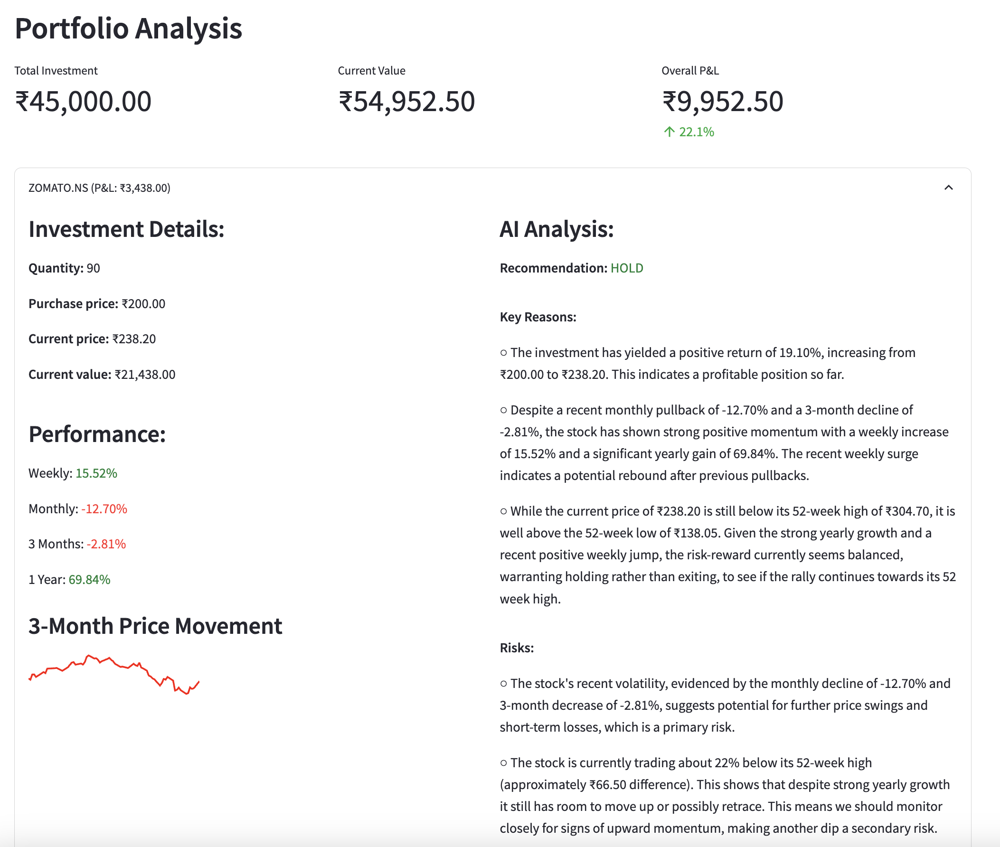

# Portfolio Analysis Application

Designed and developed a **Portfolio Analysis** application to simplify investment decision-making. Users can effortlessly monitor their portfolio's performance, understand its risk profile, and leverage AI-driven recommendations for buying, holding, or selling stocks.

## Technologies Used:
- **Python**
- **Streamlit**
- **YahooFinance**
- **Gemini API**

Deployed to Onrender Cloud.

**App Link**: https://portfolioanalysis-exej.onrender.com
----

